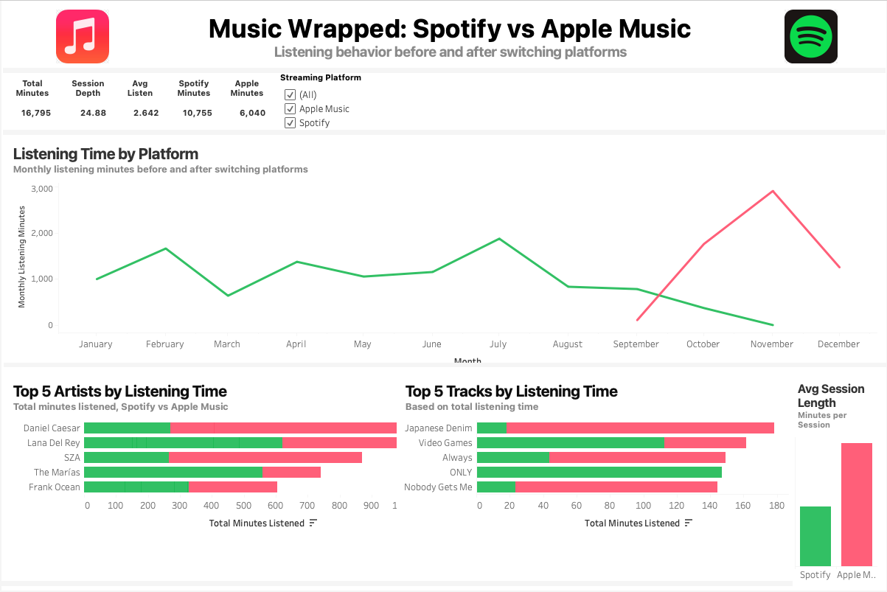
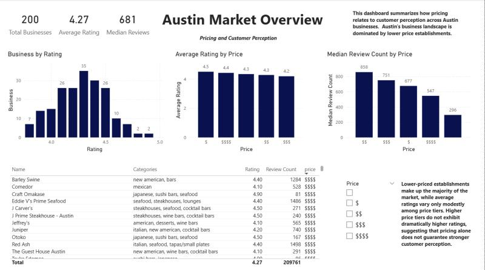
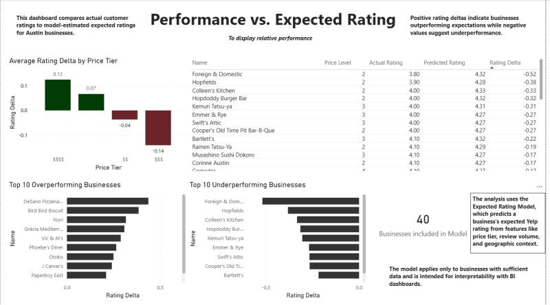
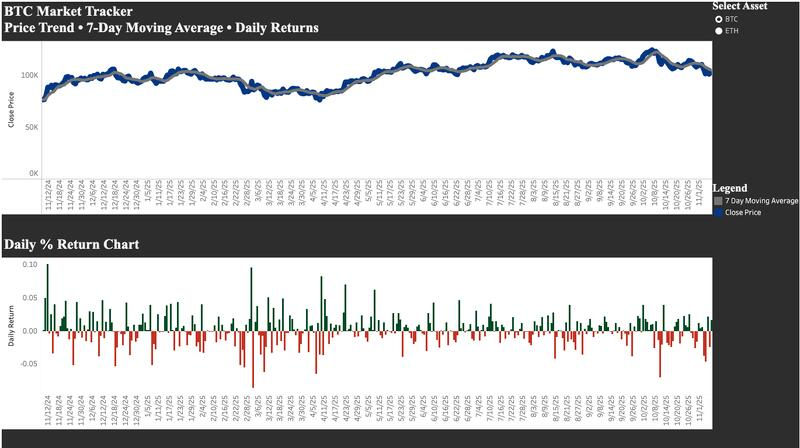

# Nathan Ho  
**Data Analyst | Business Intelligence | Applied Data Science**

B.S. Statistics & Data Science — UC Santa Barbara (2025)

I like working with data when it actually *says something*. Most of my projects focus on taking messy, real-world data and turning it into insights that are easy to understand, easy to explain, and useful for decision-making. I enjoy building things end-to-end, from data ingestion and modeling to KPIs and dashboards that tell a clear story.

Lately, I’ve been building analytics projects using **Python, SQL, Tableau, Power BI, and Excel**, with a focus on business intelligence, financial analysis, and applied data science. I’m currently pursuing full-time roles in data analytics and business intelligence.

---

## Table of Contents
- [Featured Projects](#featured-projects)
- [Technical Skills](#technical-skills)
- [Resume](#resume)
- [Connect](#connect)
- [Languages and Tools](#languages-and-tools)

---

## Featured Projects

### Music Listening Behavior Analytics  
**Python, SQLite, Tableau**

Cross-platform user behavior analysis integrating Spotify and Apple Music data into a unified event-level model. This project focuses on how listening habits change over time, including engagement intensity, session behavior, preference concentration, and discovery patterns, using interpretable KPIs and a narrative-style Tableau dashboard.

---

### Yelp Business Intelligence Platform  
**Python, PostgreSQL, Power BI**

End-to-end business intelligence project analyzing market competitiveness, pricing strategy, customer ratings, and geographic patterns using Yelp Fusion API data. The project combines SQL-based KPIs, machine learning–driven signals, and interactive Power BI dashboards to surface actionable business insights.

---

### Crypto Market Performance Analysis  
**Python, SQLite, Tableau**

Risk-aware crypto analytics pipeline evaluating Bitcoin and Ethereum performance beyond simple price movement. The project computes drawdowns, volatility regimes, Sharpe ratios, and correlation metrics, delivered through an interactive Tableau dashboard designed for exploratory analysis.

---

### Oregon Voter Big Data Analysis  
**Python, Databricks, SQL**

Large-scale voter analytics project processing 3M+ voter records using PySpark and SQL. Focuses on turnout patterns, demographic trends, and scalable data processing workflows in a big-data environment.

---

## Technical Skills

**Languages:** Python, SQL, R  
**Analytics & ML:** pandas, NumPy, scikit-learn  
**Databases:** PostgreSQL, SQLite  
**BI & Visualization:** Tableau, Power BI, Excel  
**Big Data & Cloud:** Databricks, Apache Spark, Google BigQuery  
**Workflow:** Git, GitHub, VS Code  

---

## Resume
[View / Download Resume (PDF)](resume/NathanHo.pdf)

---

## Connect
- [LinkedIn](https://www.linkedin.com/in/nathanho27)  
- [GitHub](https://github.com/nathanho27)  
- Email: **nathanho30@gmail.com**

---

## Languages & Tools

### Programming & Workflow

  
  

### Databases

  

### Business Intelligence & Data Platforms

  
  
  
  
  

